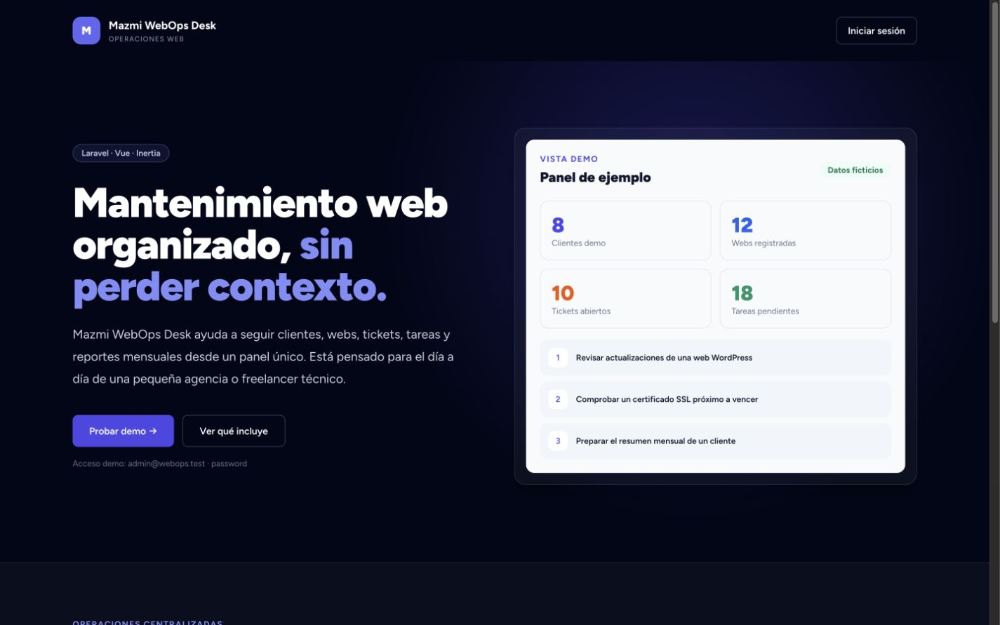
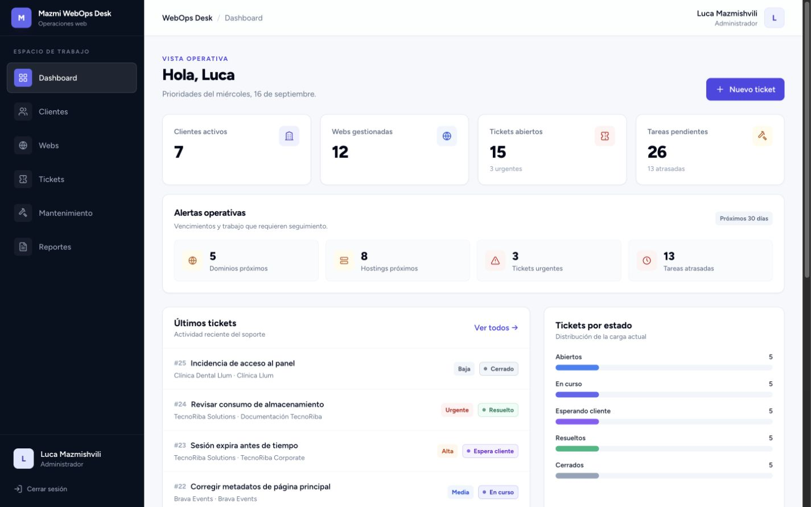
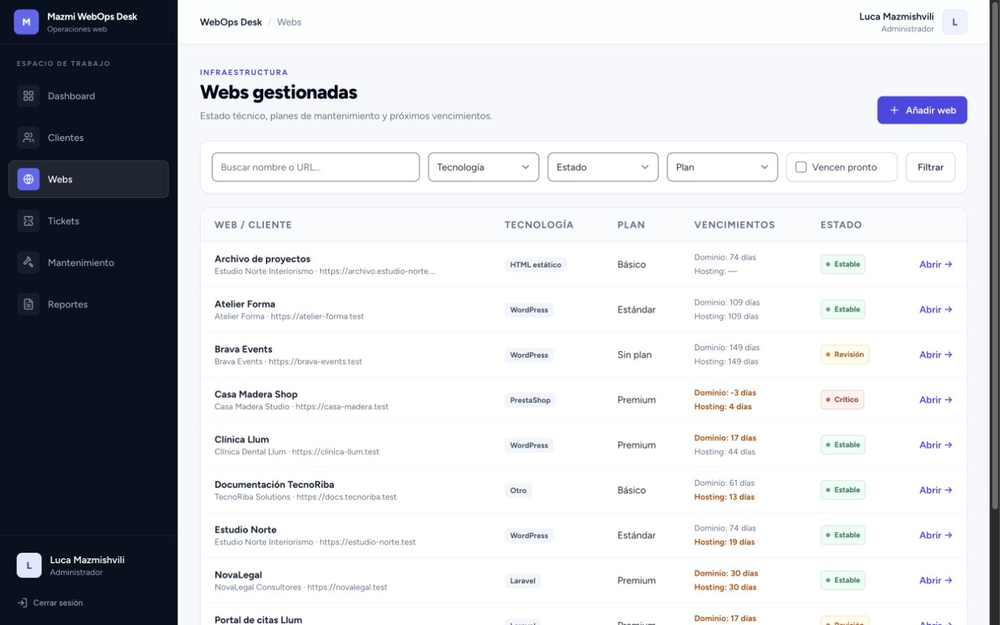
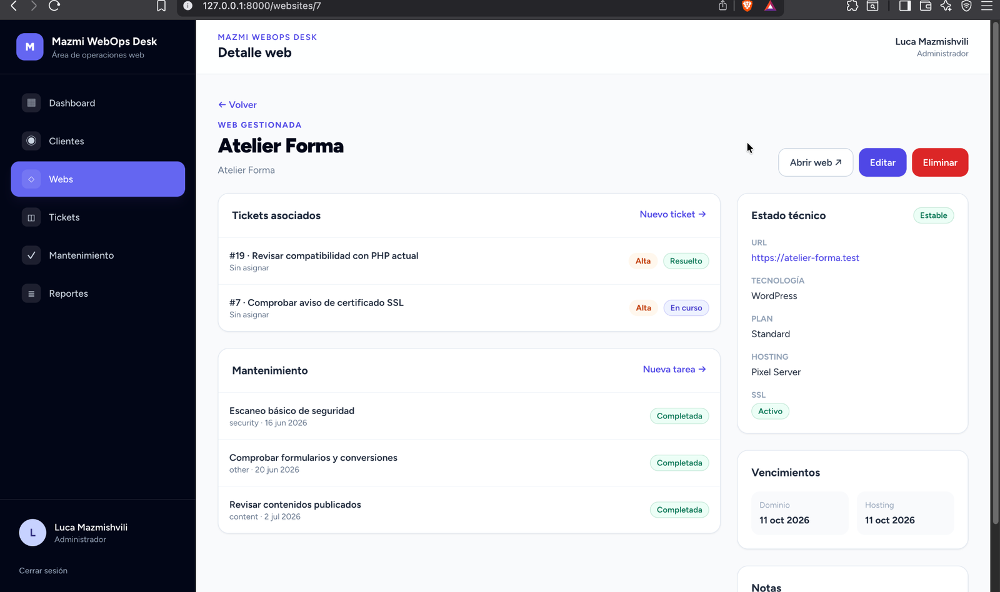

# Mazmi WebOps Desk

Panel de gestión para centralizar mantenimiento web, soporte técnico, vencimientos y reportes mensuales de clientes.

> **Estado:** versión funcional de demostración. El proyecto está orientado a evaluación técnica y todavía no está preparado para uso en producción.

[](https://github.com/LucaMZM/mazmi-webops-desk/actions/workflows/ci.yml)


Mazmi WebOps Desk es una aplicación full-stack construida con Laravel, Vue 3 e Inertia. Permite organizar clientes, webs, tickets, tareas de mantenimiento, vencimientos de dominio/hosting y reportes mensuales desde un panel privado con roles.

<a id="indice"></a>
## Índice

- [Descripción](#descripcion)
- [Capturas](#capturas)
- [Problema que resuelve](#problema-que-resuelve)
- [Funcionalidades](#funcionalidades)
- [Roles](#roles)
- [Stack técnico](#stack-tecnico)
- [Instalación](#instalacion)
- [Usuarios demo](#usuarios-demo)
- [Tests y CI](#tests-y-ci)
- [Documentación](#documentacion)
- [Próximas mejoras](#proximas-mejoras)
- [Autor](#autor)

<a id="descripcion"></a>
## Descripción

La aplicación simula el flujo de trabajo de una pequeña agencia web o de un equipo técnico que mantiene sitios de varios clientes. El objetivo es tener una vista clara de qué webs están activas, qué incidencias siguen abiertas, qué tareas están pendientes y qué información puede consultarse en reportes mensuales.

Incluye autenticación, roles, CRUDs, validaciones, filtros persistentes, seeders con datos ficticios y una interfaz responsive con Tailwind CSS.

<a id="capturas"></a>
## Capturas

### Landing



### Dashboard



### Gestión de webs



### Detalle de una web



<a id="problema-que-resuelve"></a>
## Problema que resuelve

En muchos equipos pequeños, el mantenimiento web acaba repartido entre emails, hojas de cálculo, chats y notas sueltas. Eso dificulta saber:

- qué clientes tienen webs en mantenimiento;
- qué dominios o hostings vencen pronto;
- qué tickets están abiertos o son urgentes;
- qué técnico tiene asignado cada trabajo;
- qué se ha realizado durante el mes.

Mazmi WebOps Desk reúne esa información en un panel único y evita mezclar tareas operativas con canales informales.

> El proyecto no almacena contraseñas, tokens ni credenciales reales de webs. Ese tipo de información debe gestionarse en herramientas específicas para secretos.

<a id="funcionalidades"></a>
## Funcionalidades

### Dashboard

- Métricas de clientes activos, webs gestionadas, tickets abiertos y tareas pendientes.
- Indicadores de tickets urgentes, tareas atrasadas y vencimientos próximos.
- Listados compactos de tickets recientes y próximos mantenimientos.
- Distribuciones simples por estado de ticket y tecnología de web.

### Clientes y webs

- CRUD de clientes con búsqueda por empresa, contacto o ciudad.
- Filtro de clientes por estado.
- Inventario de webs por cliente.
- Filtros de webs por tecnología, estado, plan y vencimientos próximos.
- Detalle con webs, tickets recientes, tareas y reportes relacionados.

### Tickets

- CRUD de tickets con prioridad, estado, cliente, web y técnico asignado.
- Filtros por estado, prioridad, cliente y técnico.
- Cambio rápido de estado cuando el rol lo permite.
- Registro automático de resolución mediante `resolved_at`.

### Mantenimiento

- Tareas por web con categoría, prioridad, estado y fecha programada.
- Filtros por estado, prioridad, categoría, web y agenda.
- Vista de tareas atrasadas y próximas.
- Acción para marcar tareas como completadas.

### Reportes

- Reportes mensuales por cliente, mes y año.
- Resumen, tareas completadas, tickets resueltos, tickets pendientes y recomendaciones.
- Estado general del servicio: `good`, `attention` o `critical`.
- Vista de detalle preparada para lectura y revisión desde navegador.

### Roles y seguridad

- Autenticación con Laravel Breeze.
- Autorización por rol y policies.
- Protección CSRF propia de Laravel.
- Aislamiento de datos para usuarios cliente.
- Validaciones mediante Form Requests.
- Seeders con datos ficticios reproducibles.

<a id="roles"></a>
## Roles

| Rol | Permisos principales |
| --- | --- |
| Administrador | Puede consultar y gestionar clientes, webs, tickets, tareas y reportes. También puede asignar trabajo a técnicos. |
| Técnico | Puede consultar clientes y webs, trabajar con tickets y tareas asignadas y actualizar estados. No elimina datos críticos ni reasigna trabajo. |
| Cliente | Solo puede consultar información vinculada a su empresa y crear tickets propios. No accede a datos de otros clientes. |

<a id="stack-tecnico"></a>
## Stack técnico

| Área | Tecnología | Uso dentro del proyecto |
| --- | --- | --- |
| Backend | PHP 8.3+ | Lenguaje principal del servidor |
| Framework | Laravel 13 | MVC, rutas, controladores, migraciones, seeders, validaciones y policies |
| Frontend | Vue 3 | Componentes de interfaz y pantallas de la aplicación |
| Navegación | Inertia.js 2 | Comunicación Laravel/Vue sin API REST separada |
| Estilos | Tailwind CSS 3 | Sistema visual responsive |
| Base de datos | MySQL 8 | Base de datos principal recomendada |
| Demo y CI | SQLite | Ejecución rápida local y validación automatizada |
| Assets | Vite | Desarrollo y build del frontend |
| Tests | PHPUnit 12 | Pruebas automatizadas de Laravel |

<a id="instalacion"></a>
## Instalación

### Requisitos

- PHP 8.3 o superior.
- Composer 2.
- Node.js 20.19 o superior, o Node.js 22.12 o superior.
- npm.
- MySQL 8 o SQLite para la demo.

### 1. Clonar el repositorio

```bash
git clone https://github.com/LucaMZM/mazmi-webops-desk.git
cd mazmi-webops-desk
```

### 2. Instalar dependencias

```bash
composer install
npm ci
```

### 3. Preparar el entorno

```bash
cp .env.example .env
php artisan key:generate
```

### 4. Configurar base de datos

Opción recomendada con MySQL:

```sql
CREATE DATABASE mazmi_webops_desk CHARACTER SET utf8mb4 COLLATE utf8mb4_unicode_ci;
```

Configura estas variables en `.env`:

```dotenv
DB_CONNECTION=mysql
DB_HOST=127.0.0.1
DB_PORT=3306
DB_DATABASE=mazmi_webops_desk
DB_USERNAME=root
DB_PASSWORD=
```

Opción rápida con SQLite:

```bash
touch database/database.sqlite
```

Configura en `.env`:

```dotenv
DB_CONNECTION=sqlite
```

### 5. Ejecutar migraciones y seeders

```bash
php artisan migrate:fresh --seed
```

### 6. Levantar el proyecto

En una terminal:

```bash
php artisan serve
```

En otra terminal:

```bash
npm run dev
```

Abre la aplicación en:

```text
http://127.0.0.1:8000
```

Para generar assets de producción:

```bash
npm run build
```

<a id="usuarios-demo"></a>
## Usuarios demo

Contraseña común: `password`

| Rol | Email | Alcance |
| --- | --- | --- |
| Administrador | `admin@webops.test` | Gestión completa |
| Técnico | `tech1@webops.test` | Tickets y tareas asignadas |
| Técnico | `tech2@webops.test` | Tickets y tareas asignadas |
| Cliente | `cliente1@webops.test` | Datos de su empresa |
| Cliente | `cliente2@webops.test` | Datos de su empresa |
| Cliente | `cliente3@webops.test` | Datos de su empresa |

Los datos cargados por los seeders son ficticios.

<a id="tests-y-ci"></a>
## Tests y CI

Comandos principales:

```bash
composer test
composer format:check
npm run format:check
npm run build
```

El workflow de GitHub Actions ejecuta:

- instalación de dependencias PHP y Node;
- configuración de entorno con SQLite;
- migraciones y seeders;
- formato PHP con Laravel Pint;
- formato frontend con Prettier;
- tests de Laravel;
- build del frontend con Vite.

<a id="documentacion"></a>
## Documentación

- [Esquema de base de datos](docs/database-schema.md)
- [Funcionalidades y permisos](docs/features.md)

Estructura principal:

```text
app/Http/Controllers     Controladores por módulo
app/Http/Requests        Validaciones
app/Models               Modelos Eloquent
app/Policies             Autorización por recurso
database/migrations      Esquema de base de datos
database/seeders         Datos demo
resources/js/Layouts     Layouts Inertia
resources/js/Pages       Pantallas Vue
resources/js/Components  Componentes reutilizables
docs                     Documentación técnica
tests                    Pruebas automatizadas
```

<a id="proximas-mejoras"></a>
## Próximas mejoras

- Exportación PDF de reportes.
- Notificaciones por email.
- Adjuntos en tickets.
- Calendario visual de mantenimiento.
- Más tests de interfaz y accesibilidad.
- API REST opcional.
- Demo online controlada.

<a id="autor"></a>
## Autor

**Luca Mazmishvili**  
Desarrollador web  
Valencia, España
