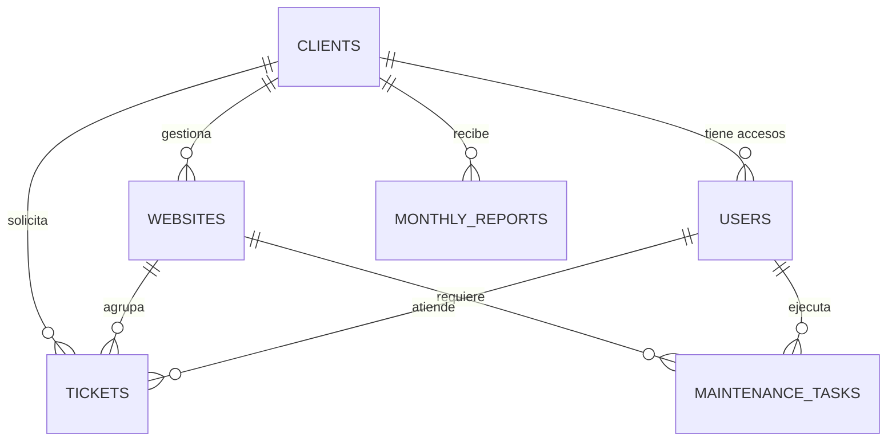

# Esquema de base de datos

Mazmi WebOps Desk utiliza MySQL como base de datos principal. SQLite se mantiene como alternativa para demo local y CI.

## Tablas

### `users`

Usuarios autenticados. `role` acepta `admin`, `technician` o `client`. `client_id` es opcional y vincula los usuarios de tipo cliente con su empresa.

### `clients`

Empresa, contacto, email, teléfono, ciudad, estado y notas operativas. Se relaciona con usuarios, webs, tickets y reportes.

### `websites`

Inventario técnico de cada cliente: URL, tecnología, hosting, vencimientos, SSL, plan de mantenimiento, salud general y notas.

### `tickets`

Solicitud de soporte vinculada a un cliente, opcionalmente a una web y a un técnico. Guarda prioridad, estado, fecha objetivo y resolución.

### `maintenance_tasks`

Trabajo preventivo o correctivo de una web. Incluye categoría, prioridad, estado, responsable, programación y finalización.

### `monthly_reports`

Informe mensual de un cliente con resumen, indicadores, recomendaciones y estado general. La combinación `(client_id, month, year)` es única.

## Reglas de integridad

- Un cliente con webs, tickets, reportes o usuarios asociados no se elimina desde la interfaz.
- Una web con tickets o tareas tampoco se elimina.
- Si se elimina un técnico, las asignaciones quedan a `NULL` mediante `nullOnDelete`.
- Si desaparece una web mediante una operación administrativa externa, sus tickets conservan el cliente y pierden únicamente la referencia opcional a la web.
- Los reportes no pueden duplicar el mismo cliente y periodo.

## Seguridad de datos

El esquema no incluye campos para contraseñas, tokens o credenciales de webs. Las notas son exclusivamente operativas; los secretos deben almacenarse fuera de la aplicación.
